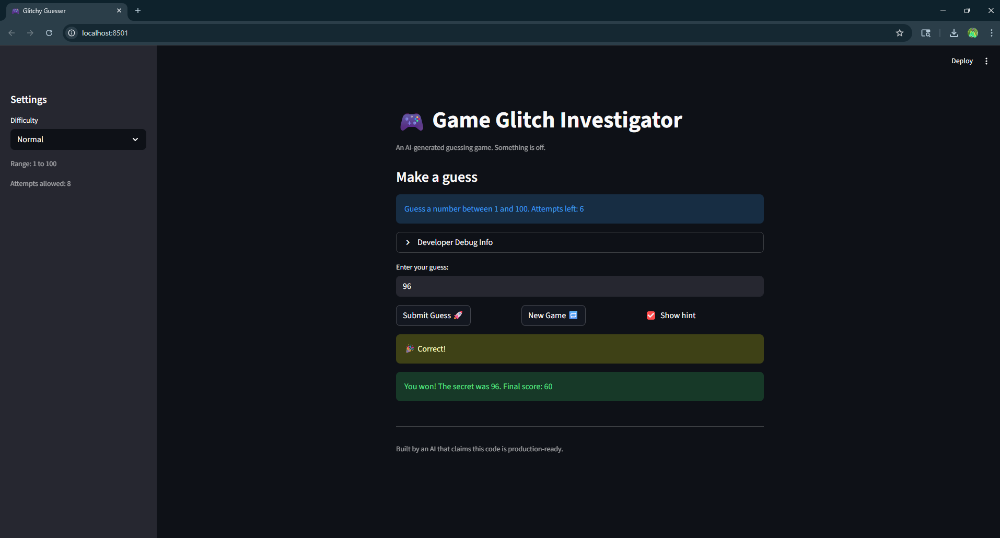
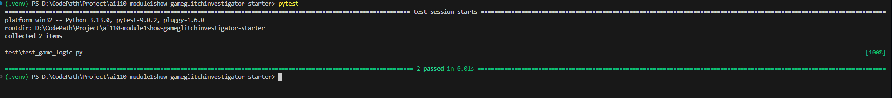

# 🎮 Game Glitch Investigator: The Impossible Guesser

## 🚨 The Situation

You asked an AI to build a simple "Number Guessing Game" using Streamlit.
It wrote the code, ran away, and now the game is unplayable. 

- You can't win.
- The hints lie to you.
- The secret number seems to have commitment issues.

## 🛠️ Setup

1. Install dependencies: `pip install -r requirements.txt`
2. Run the broken app: `python -m streamlit run app.py`

## 🕵️‍♂️ Your Mission

1. **Play the game.** Open the "Developer Debug Info" tab in the app to see the secret number. Try to win.
2. **Find the State Bug.** Why does the secret number change every time you click "Submit"? Ask ChatGPT: *"How do I keep a variable from resetting in Streamlit when I click a button?"*
3. **Fix the Logic.** The hints ("Higher/Lower") are wrong. Fix them.
4. **Refactor & Test.** - Move the logic into `logic_utils.py`.
   - Run `pytest` in your terminal.
   - Keep fixing until all tests pass!

## 📝 Document Your Experience

During this project I worked on debugging a number guessing game that had several glitches. The secret number was resetting every time the player submitted a guess because Streamlit reruns the entire script on interaction. I fixed this by using Streamlit session state so the secret number persists during the game.

Another issue was incorrect hint logic where the game sometimes gave the wrong "Higher" or "Lower" feedback. I corrected the comparison logic in the guess-checking function and moved the core game logic into `logic_utils.py` to separate it from the UI.

I also added automated testing using pytest. For example, I created a test to verify that if the secret number is 50 and the guess is 60, the function returns the correct hint ("lower"). Running `python -m pytest` confirmed that the test passed and that the logic works correctly.

## 📸 Demo

## 🚀 Stretch Features

- [ ] [If you choose to complete Challenge 4, insert a screenshot of your Enhanced Game UI here]
